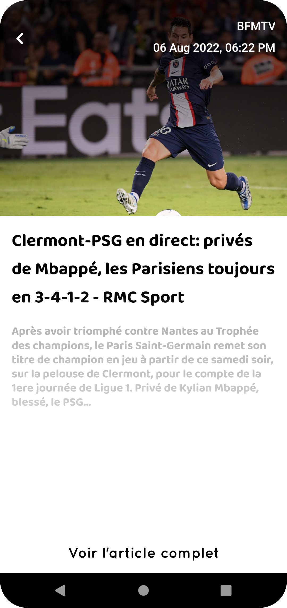
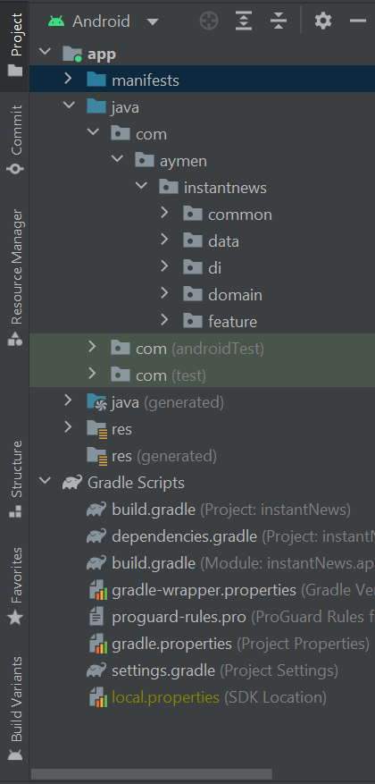
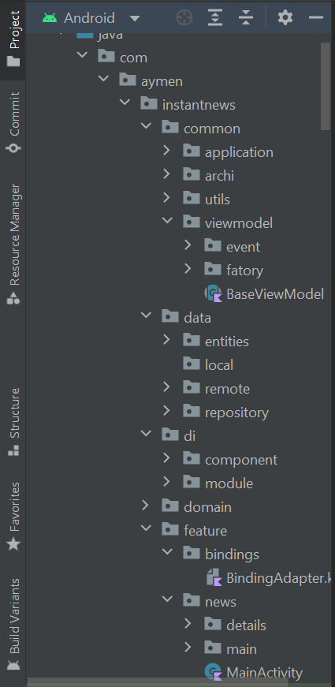

# News App

The News app for top headlines in France using MVVM architecture, Retrofit, Dagger 2, Coroutines with Unit testing (truth) & UI testing (Espresso) 
**Note:** Generate Api Key for this App from News Api & paste in UrlConstant to execute this project - [Get Here](https://newsapi.org/register)   

        
        

 

#### The app has following packages:
1. **common**: It contains all application base Logic and utils
2. **data**: It contains model layer
3. **di**: Dependency providing classes using Dagger2.
4. **domain**: Use cases executers with single responsibility for each class.
5. **feature**: ui layer handling with ViewModel classes
  

        
        

 

## Library reference resources:
 All library used are in central gradle file named [dependencies](dependencies.gradle). Please check it for more info.

## Detekt report:
 To check generated report by static code analyzer [detekt](https://detekt.dev/), please check this [report](reports/detekt/detekt-report.htm)

## What's next:
1. **Test**: add test for ui with real remote data.
2. **local data**: save news locally for offline use
3. **widget**: add widget to display realtime news on device default home screen

